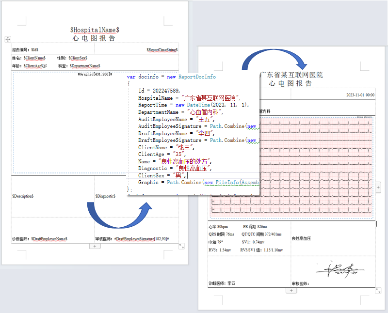
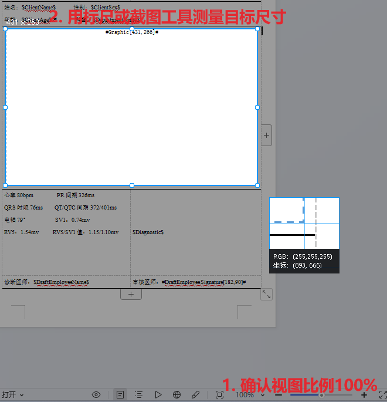
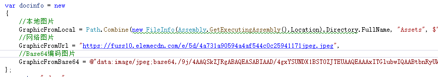
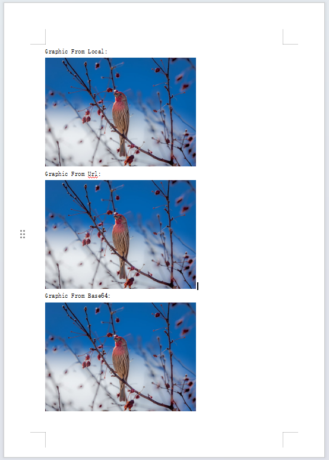
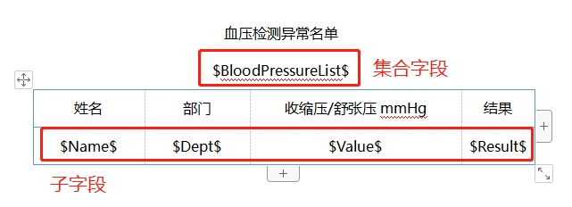
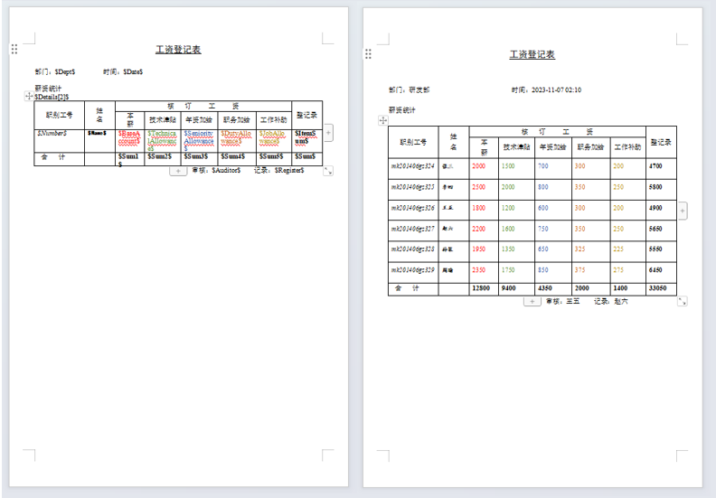
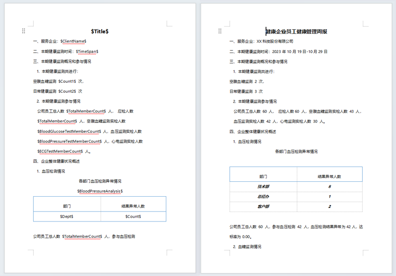
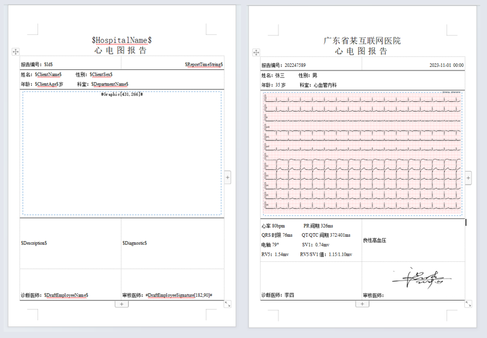
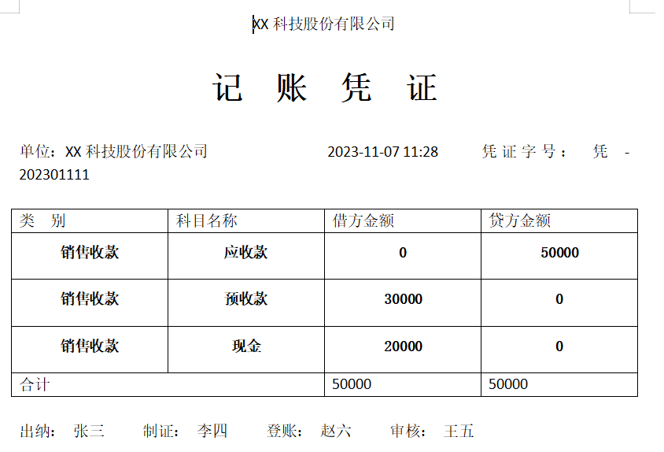

# Document Template Tool

指定一个模板生成word或Pdf文件



**运行单元测试以查看示例！**


## 功能 & 特点
* 基于占位符的模板，可继承原有样式；
* 支持表格；
* 支持数据集合；
* 支持图片；
* 提供Cli版本程序；
* 可扩展的接口封装和组件。


## 快速开始


### 使用Cli

进入可执行文件所在目录，在命令提示符中运行`DocTemplateTool.exe`


参数列表:

| 参数  |    含义     | 用法                                                                                                                                                                                                  |
| :---: | :---------: | :---------------------------------------------------------------------------------------------------------------------------------------------------------------------------------------------------- |
|  -p   | PatternFile | 指定一个Object文件(Json), 作为数据源件                                                                                                                                                         |
|  -i   |    Input    | 指定一个docx文件作为模板 |
|  -o   |   Output    | 指定一个路径，作为导出目标 |
|  -s   |   Source    | 值为`json`                                                                                                                                                         |
|  -d   | Destination | 值为`word`,` pdf`                                                                                                                                                         |
|  -w   |  WaitAtEnd  | 指定时，程序执行完成后，将等待用户输入退出                                                                                                                                                            |
|  -h   |    Help     | 查看帮助                                                                                                                                                                                              |


示例
```
.\wtt.exe -p .\sample\data.json -i .\sample\template.docx -o .\output\test.docx -s json -d word
```


### 使用DocTemplateTool.Word类库

在项目中引用[DocTemplateTool.Word]( https://www.nuget.org/packages/DocTemplateTool.Word)


```
dotnet add package DocTemplateTool.Word
```


由于Exporter返回的NPOI对象，你需要自行根据业务来处理结果，以及处理IO异常

```
byte[] docFileContent;

var docinfo = GetDocInfo(); // 准备数据
var result = Exporter.ExportDocxByObject("D:\\Template.docx", docinfo); //生成NPOI文档对象

//处理结果
using (var memoryStream = new MemoryStream())
{
    result.Write(memoryStream);
    memoryStream.Seek(0, SeekOrigin.Begin);
    docFileContent = memoryStream.ToArray();
}

//写入文件或返回接口
File.WriteAllBytes("D:\\Result.docx", docFileContent);

```


### 使用DocTemplateTool.Pdf类库

在项目中引用[DocTemplateTool.Pdf]( https://www.nuget.org/packages/DocTemplateTool.Pdf)


```
dotnet add package DocTemplateTool.Pdf
```


由于Exporter返回的PdfSharp.PdfDocument对象，你需要自行根据业务来处理结果，以及处理IO异常

```
var docinfo = GetDocInfo(); // 准备数据
var result = Exporter.ExportDocxByObject("D:\\Template.docx", docinfo);
//处理结果
result.Save("D:\\Result.docx");
```


## 占位符

占位符是指在模板中的一个标记，用于标记需要替换的文本或图片，
文本占位符的格式为：`$字段名称[附加属性]$`
图片占位符的格式为：`#字段名称[附加属性]#`

Exporter将扫描文档中所有占位符，然后根据占位符的名称，从数据源中获取对应的文本值或图片内容，替换到文档中。


## 文本

例如

```
姓名：$ClientName$
```

将被替换为

```
姓名：张三
```

## 图片

### 确认大小

图片占位符支持附加属性，用于指定图片的宽度和高度，格式为：`#字段名称[宽度,高度]#`

```
#Graphic[431,266]#
```
将被替换为一个宽度为431，高度为266的图片，单位为像素。
若不指定宽度和高度，则使用默认图片尺寸556*262。
在Word文档中，因为像素大小是个相对值，页面视图100%时的大小为实际像素尺寸，你可以使用截图工具或标尺工具确认图片的大小。




### 设置图片

图片源支持本地文件和网络图片以及Base64编码的图片。



从不同图片来源生成文档的示例运行如下：





## 数据集合

暂不支持表格的嵌套。
数据集合将以表格的形式呈现在文档中，因此你需要在模板中预留一个表格，Exporter将根据表中单元格的占位符，填充表格各列的内容。
包含占位符的行称之为模板行。

定义

```
public class HealthReportDocInfo
{
    ...
    public List<DetailList> BloodPressureList { get; set; }
}

public class DetailList
{
    public string Name { get; set; }
    public string Dept { get; set; }
    public string Value { get; set; }
    public string Result { get; set; }
}
```
配置模板表格：



默认以第二行作为模板行（通常第一行为表头），你也可以根据实际情况跳过表头，

例如在工资登记表示例中，表头占两行的情况下，第三行为模板行，那么你需要在配置中指定模板行的索引为2（索引从0开始）。
```
$Details[2]$
```

模板行的样式将决定表格的样式，因此你可以在模板行中设置表格的样式，例如设置表格的字体，颜色，大小等。

示例运行如下图：



## 其他示例

企业员工健康管理周报



心电图报告




### 数据源

数据源支持从哈希表（字典）或对象中获取数据。

Exporter提供了ExportDocxByDictionary和ExportDocxByObject两个方法，分别用于从哈希表和对象中获取数据。

从哈希表中获取数据：
```
var docinfo = new Dictionary<string, object>()
{
    {"Dept", "XX科技股份有限公司" },
    {"Date",  DateTime.Now     },
    {"Number",  "凭 - 202301111"     },
    {"Details",  new List<Dictionary<string, object>>(){

        new Dictionary<string, object>(){
            { "Type","销售收款"},
            { "Name","应收款"},
            { "DeptorAmount",0},
            { "LenderAmount",50000}
        },
            new Dictionary<string, object>(){
            { "Type","销售收款"},
            { "Name","预收款"},
            { "DeptorAmount",30000},
            { "LenderAmount",0}
        },
        new Dictionary<string, object>(){
            { "Type","销售收款"},
            { "Name","现金"},
            { "DeptorAmount",20000},
            { "LenderAmount",0}
        },

    }},
    { "DeptorSum",  50000     },
    { "LenderSum",  50000     },
    { "ClientName",  "XX科技股份有限公司"     },
    { "Teller",  "张三"     },
    { "Maker",  "李四"     },
    { "Auditor",  "王五"     },
    { "Register",  "赵六"     },
};
var result = Word.Exporter.ExportDocxByDictionary(Path.Combine(templatePath_Doc, $"AccountingTemplate.docx"), docinfo, (s) => s);


```

从匿名对象中获取数据：

```
var docinfo = new
{

    Dept = "XX科技股份有限公司",
    Date = DateTime.Now,
    Number = "凭 - 202301111",
    Details = new List<dynamic>() {

        new
        {
            Type = "销售收款",
            Name = "应收款",
            DeptorAmount = 0,
            LenderAmount = 50000
        },
        new
        {
            Type = "销售收款",
            Name = "预收款",
            DeptorAmount = 30000,
            LenderAmount = 0
        },
        new
        {
            Type = "销售收款",
            Name = "现金",
            DeptorAmount = 20000,
            LenderAmount = 0
        },
    },
    DeptorSum = 50000,
    LenderSum = 50000,
    ClientName = "XX科技股份有限公司",
    Teller = "张三",
    Maker = "李四",
    Auditor = "王五",
    Register = "赵六",
};

var result = Word.Exporter.ExportDocxByObject(Path.Combine(templatePath_Doc, $"AccountingTemplate.docx"), docinfo, (s) => s);
```

它们将得到同样的结果：




## 已知问题


## 作者信息

作者：林小

邮箱：jevonsflash@qq.com


## License

The MIT License (MIT)
